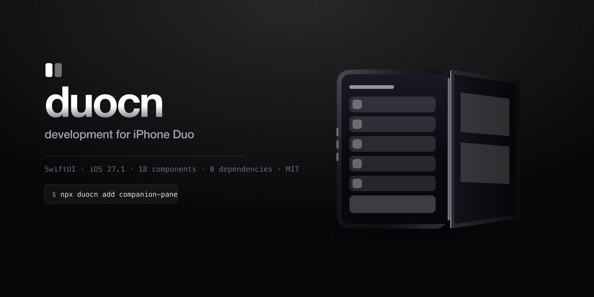

<div align="center">



<br>

**SwiftUI components that know the phone folds.**

Opinionated presets for Apple's iPhone Duo APIs — plus the pose harness Xcode doesn't give you.

<br>


<br>

```bash
npx duocn add companion-pane
```

</div>

<br>

## Why this exists

Apple ships the primitives. In iOS 27.1 you get `ReservedRegion`, `DeviceHinge`,
`ArrangementView` and the vertical toolbar behaviours — and almost no opinions about how to use
them.

**duocn is the opinionated layer on top. It is not a parallel framework.**

We are explicit about this because it would be easy to pretend otherwise. If a component here
duplicates something Apple ships, we delete it and tell you to use theirs:

| We used to ship | Apple ships | What we did |
|---|---|---|
| `HingeSplit` | `ArrangementView` | Deleted. Use theirs. |
| `HingeTabBar` | `toolbarVerticalBehavior(_:)` | Deleted. It fought the platform. |
| `DuoDragBridge` | — | Deleted. It solved a problem that doesn't exist.¹ |

> ¹ It assumed the fold was a physical gap that cancels drags. The inner display is one continuous
> 7.6″ folding OLED. There is no gap, and the touch is never lost.

What's left is what Apple genuinely leaves to you: **presets**, **a pose harness**, and **a fold-aware
motion vocabulary**.

<br>

## Install

**Swift Package Manager**

```swift
.package(url: "https://github.com/duocn/duocn", from: "0.9.0")
```

**Or copy one file and own it**

```bash
npx duocn add companion-pane --dest Sources/App/UI
```

Dependencies come along automatically, so what lands compiles. No lockfile entry, no runtime,
nothing to upgrade — it's your code from that point.

> [!IMPORTANT]
> **Requires iOS 27.1 and an Xcode with the iOS 27.1 SDK.** Every Duo API this is built on is
> currently flagged **Beta** by Apple, so signatures may change before GA. That's why this is
> `0.9.0` and not `1.0.0` — a beta dependency can't carry a stability promise.

<br>

## Your first Duo screen

Lay out with size classes first. That's Apple's guidance and it covers most cases.

```swift
import SwiftUI
import DuoCN

@main
struct StudioApp: App {
    @State private var track: Track?

    var body: some Scene {
        WindowGroup {
            DuoStage {
                ArrangementView {
                    TrackList(selection: $track)
                } secondary: {
                    NowPlaying(track: track)
                }
                .arrangementViewStyle(.split)
            }
            .toastCenter()
        }
    }
}
```

`DuoStage` is a **harness**, not a layout engine. It resolves the pose, publishes fold geometry, and
lets you pin any pose in a `#Preview` — so you never unfold a physical device to check a layout.

```swift
#Preview("Seated") {
    DuoStage(pose: .seated) { LibraryView() }
}
```

<br>

## Two vocabularies. Don't conflate them.

This is the single most common modelling error on this device.

Apple names **five poses** for people, and exposes **three hinge states** to code.

| Pose | `DeviceHinge.Status` | Width class | Display | Division region |
|---|---|---|---|---|
| **Closed** | `.closed` | compact | Outer | — |
| **Portrait** | `.fullyOpen` | regular | Inner | — |
| **Landscape** | `.fullyOpen` | regular | Inner | — |
| **Seated** | `.partiallyOpen` | regular | Inner | horizontal |
| **Standing** | `.partiallyOpen` | regular | Outer | vertical |

Portrait and Landscape are **both fully open** — they differ by orientation, not hinge state. Which
means a fully open Duo has **no active division region**: the inner display is one continuous canvas.
Only a partially open device divides.

> [!TIP]
> Aspect ratio can't tell you the pose. The closed outer display is `1398×2034` (ratio **0.687**) and
> the fully open device in Portrait is `1878×2670` (ratio **0.703**). Those are 2% apart. Any library
> inferring pose from window shape will report an open device as closed — ours used to.

<br>

## What's in it

<table>
<tr><td><b>Foundations</b></td><td><code>DuoTheme</code> · <code>GlassCard</code> · <code>DuoHaptics</code></td></tr>
<tr><td><b>Duo Layout</b></td><td><code>DuoStage</code> · <code>CompanionPane</code> · <code>SpanningScroll</code></td></tr>
<tr><td><b>Controls</b></td><td><code>DuoButton</code> · <code>LiquidSlider</code> · <code>HapticToggle</code> · <code>SegmentedPill</code></td></tr>
<tr><td><b>Navigation</b></td><td><code>FloatingDock</code> · <code>DuoSheet</code></td></tr>
<tr><td><b>Feedback</b></td><td><code>ToastCenter</code> · <code>ShimmerSkeleton</code> · <code>ProgressRing</code></td></tr>
<tr><td><b>Media</b></td><td><code>DuoPreviewStage</code> · <code>CoverCarousel</code> · <code>AvatarStack</code></td></tr>
</table>

**18 components. Six of them do something a single-screen phone physically cannot.**

`DuoPreviewStage` implements the pattern behind Apple's shipping **Duo Preview**: with the device
open, the outer display faces your subject so they can see their own framing while you shoot with the
rear cameras.

<br>

## Three rules the kit follows

1. **Scrollable content may cross the fold. Interactive elements may not.**
   Crossing is the documented exception — it's hit targets that must stay clear.
2. **A fully open Duo is one continuous canvas.** Only a partially open one has an active division region.
3. **Every open layout has a defined closed fallback.** No pose is a dead end.

<br>

<details>
<summary><b>Migrating from 0.x</b></summary>

<br>

The old `DuoPosture` enum (`.folded / .book / .tent / .flat`) matched neither Apple vocabulary, and
inferred the pose from window aspect ratio — which provably cannot work.

| 0.x | 0.9 |
|---|---|
| `DuoPosture` | `DuoPose` (five Apple poses) + `DuoHingeStatus` (three runtime states) |
| `\.duoPosture` | `\.duoPose` — but prefer `horizontalSizeClass` for layout |
| `DuoHinge` / `.occlusion` | `DuoFold` / `.divisionWidth`, or `ReservedRegion(kind: .division)` |
| `DuoScreen` (3 values) | `DuoDisplay` (`.inner` / `.outer`) — the Duo has exactly two displays |
| `HingeSplit` | `ArrangementView` (first-party) |
| `HingeTabBar` | System vertical controls — `toolbarVerticalBehavior(_:)` |
| `DuoDragBridge` | Removed, no replacement needed |
| `MirrorStage` | `DuoPreviewStage` |

Deleted symbols ship a one-release deprecation shim naming the Apple API that replaces them.

</details>

<details>
<summary><b>Repo layout &amp; development</b></summary>

<br>

```
├── swift/DuoCN/        the library — Swift package, zero dependencies
├── app/ components/    the docs site — Next.js 15, Tailwind v4
├── content/registry.ts component metadata (one source of truth)
├── cli/duocn.mjs       npx duocn add <component>
└── assets/             banner artwork
```

```bash
npm install
npm run dev        # docs site on http://localhost:3100
npm run registry   # regenerate public/registry/*.json, which the CLI installs from
```

The site reads the Swift straight off disk, so the code on a component page **is** the code in the
package — there is no second copy to drift.

```bash
swift test --package-path swift/DuoCN
```

Tests cover pose inference (including the regression that closed and open-Portrait are
indistinguishable by aspect ratio), the pose → hinge-status mapping, and that a fully open device
reports no active division region.

</details>

<br>

## Licence

MIT. Copy the file, own the code.
